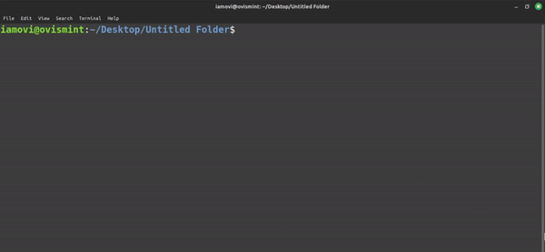

## MarufOvi-CLI


### Overview

MarufOvi-CLI is a command-line interface (CLI) tool designed to interact with Maruf OVi's GitHub repositories seamlessly. With this tool, you can easily explore, open, and clone repositories, making it convenient to access and work with Maruf OVi's projects.

### Features

- Intuitive Menu System: Choose from different categories of repositories or explore additional URLs with a user-friendly menu system.

- Open Repositories: Quickly open selected repositories in your default web browser to view code, issues, and other details.

- Clone Repositories: Clone repositories directly to your local machine, enabling you to contribute, experiment, or collaborate effortlessly.

- Additional URLs: Access other useful URLs, such as contact information, with just a few clicks.

### Installation

> Ensure you have Node.js & git installed on your machine.

To use MarufOvi-CLI, follow these simple steps:

**1** Install marufovi-cli globally - 
```bash
npm i -g marufovi-cli
```

**2** Update cli if available to get latest repos - 
```bash
npm update -g marufovi-cli
```

### Usage

Execute the `marufovi` command in your terminal to launch the interactive menu. From there, you can navigate through different categories, repositories, and actions.

```bash
marufovi
```

Follow the on-screen prompts to explore, open, or clone repositories, and enjoy seamless interaction with Maruf OVi's GitHub projects.

### Dependencies

- Inquirer: A powerful library for handling interactive prompts in the command line.
- ShellJS: A cross-platform shell toolkit, providing convenient shell commands.

### Author

- [Maruf OVi](https://oviportfo.netlify.app/)

### License

This project is licensed under the [MIT](LICENSE) License.

## yourCLI (optional)

Create your own cli.

Visit yourCLI repo - [https://github.com/iamovi/yourcli](https://github.com/iamovi/yourcli)